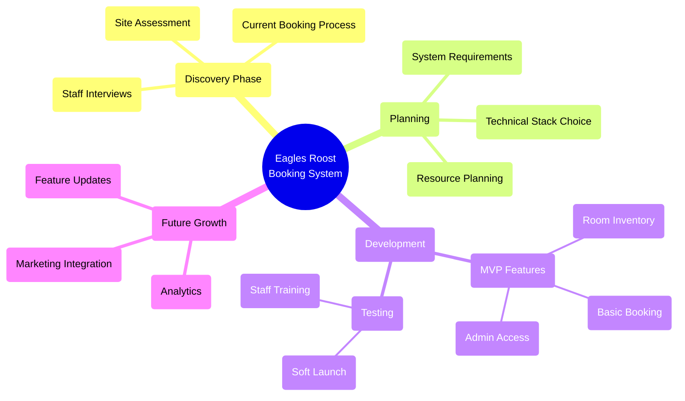

# Eagles Roost Resort Booking System

## Project Flow Diagram

This mind map represents the high-level project flow for implementing the booking system at Eagles Roost Resort.

## Phase Descriptions

### Discovery Phase
- Understanding current operations
- Identifying pain points
- Gathering stakeholder requirements

### Planning
- Defining core system requirements
- Selecting appropriate technologies
- Allocating resources

### Development
- Building core MVP features
- Testing with staff
- Implementing feedback

### Future Growth
- Planning for scalability
- Integration opportunities
- Feature expansion